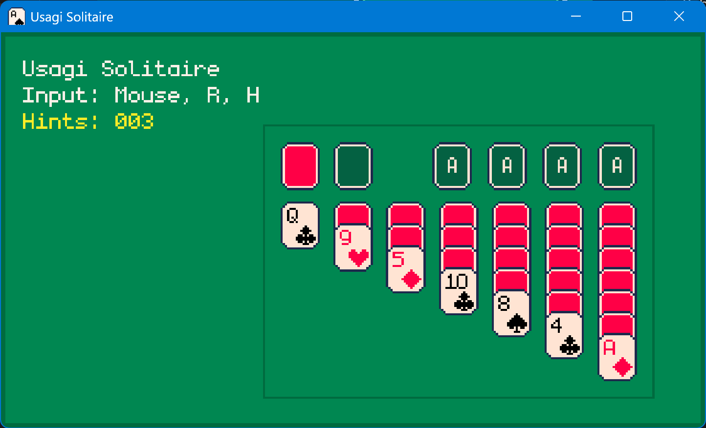
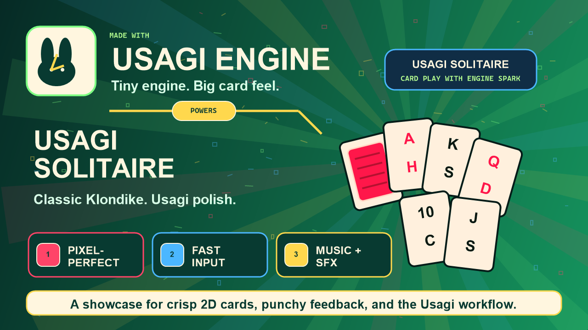

# Usagi Solitaire
Usagi Solitaire is a Klondike-style solitaire game created with the [Usagi Engine](https://github.com/brettchalupa/usagi) for rapid 2D game dev.

Deal a shuffled deck, drag legal tableau runs with the mouse, draw from the stock when no board moves are available, and build all four foundations from ace to king.

  
## Pics

### Screenshot

### Infographic

  
## Input

| Key | Behavior |
| --- | -------- |
| `Mouse` | Drag face-up tableau runs, waste cards, and foundation tops onto legal targets. |
| `Mouse` | Click the face-down stock to instantly move one card to the waste pile. |
| `R` | Reset and deal a new game. |
| `Esc` | Opens the pause menu (built-in to Usagi). |
| `Alt+Enter` | Toggle fullscreen (engine shortcut). |

  
## Rules

| Area | Behavior |
| ---- | -------- |
| Deal | Cards tween from off-screen top center into seven tableau piles, then the face-down stock lands above the first pile. |
| Tableau | Stack descending ranks with alternating colors. Empty columns accept kings. |
| Stock | Draws one card to the waste pile with no animation. Waste recycling is not used. |
| Foundations | Aces start foundation piles, then cards build upward by matching suit. |
| Win | Completing all four foundations shows `status: you won` in the UI. |

  
## Stack

| Area | Choice |
| ---- | ------ |
| Language | [Lua 5.5](https://www.lua.org/manual/5.5/) |
| Engine | [Usagi 1.0.0](https://github.com/brettchalupa/usagi) |

  
# Credits

**Created By**

Samuel Asher Rivello. Over 25 years XP with game development (2025); over 10
years XP with Unity (2025).

**Contact**

| Channel | Link |
| ------- | ---- |
| Twitter | [@srivello](https://twitter.com/srivello) |
| Git | [Github.com/SamuelAsherRivello](https://github.com/SamuelAsherRivello) |
| Resume & Portfolio | [SamuelAsherRivello.com](https://www.SamuelAsherRivello.com) |
| LinkedIn | [Linkedin.com/in/SamuelAsherRivello](https://www.linkedin.com/in/SamuelAsherRivello) |
